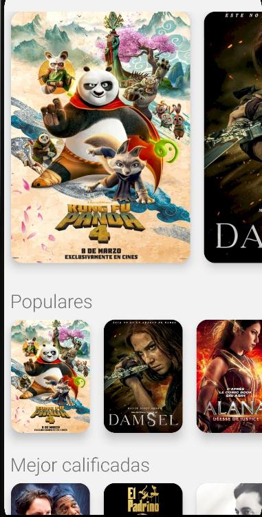

# Movies
Aplicativo de películas realizado en React Native CLI.

## Dev
1. Clonar el proyecto
2. Instalar dependencias `npm install`
3. Clonar el archivo .env.example a .env y configurar las variables de entorno
4. Obtener api-key de `https://www.themoviedb.org/` y colocar el valor en THE_MOVIE_DB_KEY(.env)
4. Ejecutar el proyecto `npx react-native run-android`
5. IOS: `npm run start:ios` configurar el simulador

## Vista inicio

## Vistas detalle

## Authors

- [@drusystem](https://www.github.com/drusystem)